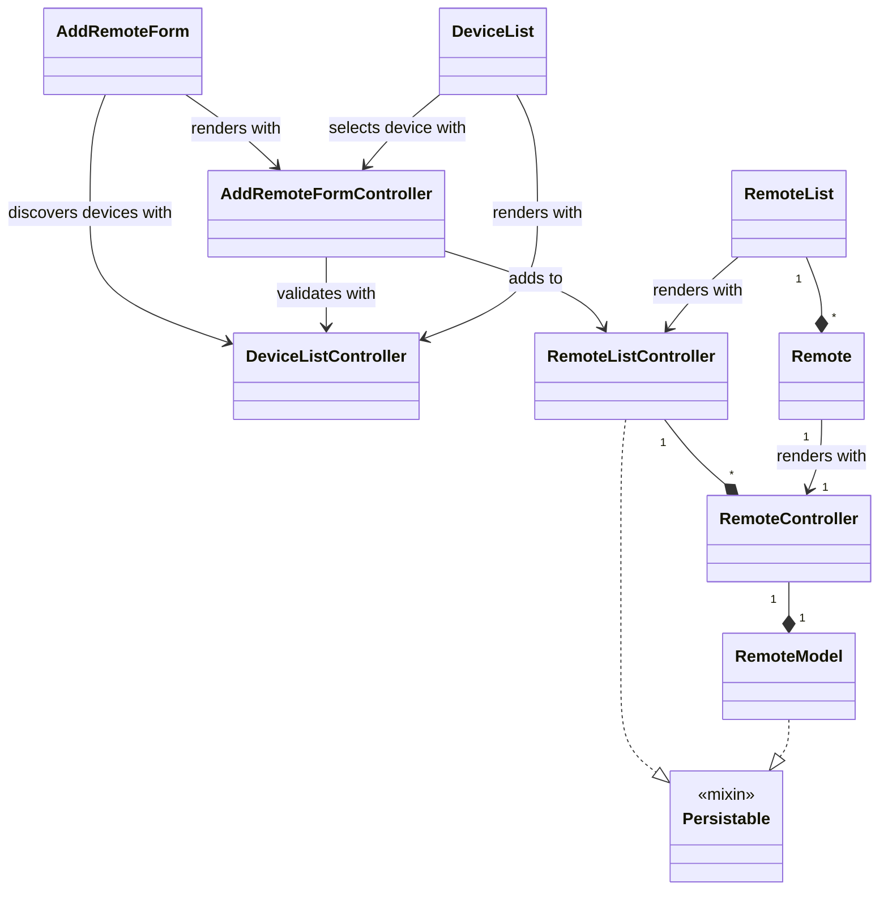

# TV Mate

## System Architecture

- Application which uses mDNS to find devices. The protocol to communicate with the devices is websocket.
- UI contains virtual remote controls which sends hex codes over the websocket. The device interprets the hex codes and fires the corresponding IR signal.

## Design Patterns

- Code is split between view and controller files.
    - View is only UI.
    - Controller is for business logic and data models.
        - Always extends `ChangeNotifier`.
- Canvas subpackage uses composite pattern which allows easy extension of custom shapes and whatnot.
    - Custom shapes must extend `InteractiveItem`.

## UML

## Future Work

- Increased security to prevent device hacking.
- Increased security to prevent application hacking.
- Let users build their own floor plans.